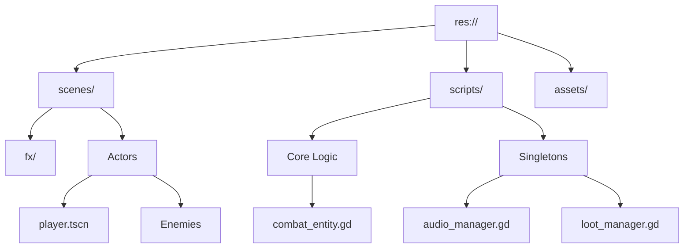
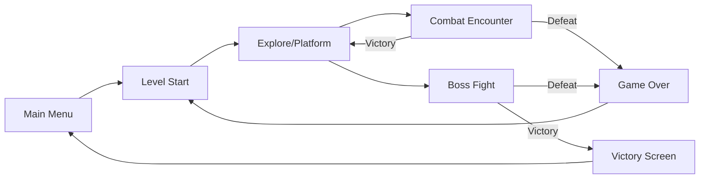

# 🗡️ LiveCells

> **Precision steel against an empire of tyranny.**

LiveCells is a high-octane 2D Pixel Art Samurai action-platformer built in **Godot 4**. It combines the fluidity of modern platformers with the tactical depth of traditional fighting game archetypes.

---

## 🎮 The Experience

### The Core Loop
1. **Explore:** Navigate intricate 2D environments with fluid movement (dash, wall-jump).
2. **Fight:** Engage in "steel-to-steel" combat where every frame counts.
3. **Survive:** Manage health through tactical defense and a dynamic loot economy.
4. **Conquer:** Overcome elite AI archetypes and ultimate boss challenges.

### ⌨️ Controls Manual
> | Action | Input | Rationale |
> | :--- | :--- | :--- |
> | **Move** | `A` / `D` | Precision positioning. |
> | **Jump** | `Space` | Fluid verticality. |
> | **Attack** | `Left Click` / `K` | 3-Hit combo system. |
> | **Parry** | `Right Click` / `O` | Frame-perfect defense. |
> | **Dash** | `Shift` / `L` | Evasion with i-frames. |

---

## 🧠 Tactical AI Bestiary
LiveCells features a unique "Archetype System" where enemies follow established fighting game philosophies, forcing the player to adapt their strategy.

*   **🥋 Shoto (The All-Rounder):** Balanced and disciplined. Uses a mix of approach and defensive tactics to keep the player honest.
*   **🔥 Rushdown (The Aggressor):** Relentless pressure. Lunging attacks and counters designed to overwhelm a defensive player.
*   **🏹 Zoner (The Strategist):** Ranged dominance. Maintains distance with proactive dashing and a triple-shot arrow sequence.
*   **🌑 Grappler (The Titan):** High risk, high reward. Slow, telegraphed strikes that punish mistakes with massive damage.

---

## 🏗️ Technical Architecture

### The Combat Engine (`CombatEntity.gd`)
The heart of LiveCells is the `CombatEntity` base class. It abstracts complex interactions into a unified signal-based system:
- **Profile-Based Hitboxes:** Attacks are defined by Dictionaries containing `pos`, `size`, and `damage`, allowing for frame-specific precision.
- **Unified Interaction:** All entities (Player and Enemy) share the same hit/hurt logic, ensuring consistent behavior across the board.

### System Managers (Singletons)
- **`AudioManager`:** High-performance SFX pooling supporting 32+ simultaneous streams with pitch randomization.
- **`LootManager`:** Handles the item economy and global effects like **Hit-Stop** (time dilation) to maximize combat feedback.
- **`GameManager`:** Manages high-level state transitions and global game flags.

### 📂 Directory Map

---

## 📅 Development History

Click to view development milestones (Week 1-16)

### Week 2: Living Concept Document
**Title:** LiveCells  
**Tagline:** Precision steel against an empire of tyranny.  
**Hook:** A 2D Pixel Art Samurai action-platformer where every strike carries weight, featuring tactical AI archetypes and visceral combat feedback.

**Core Gameplay Loop:**
1. **Explore:** Navigate through 2D levels with fluid movement (dash, wall jump).
2. **Fight:** Engage in precision-based combat against diverse enemy archetypes.
3. **Survive:** Manage health through tactical defense (perfect block, dash i-frames) and loot drops.
4. **Boss:** Overcome ultimate challenges to progress through the empire.

**Genre & Inspirations:**
- **Primary Genre:** Action-Platformer / Fighting.
- **Inspirations:** *Sekiro: Shadows Die Twice* (for precision blocking), *Dead Cells* (for fluid movement and visual juice), *Street Fighter* (for distinct enemy archetypes), and *Hollow Knight* (parkour intensive levels).

**Technical Feasibility:**
- **Systems Required:** Profile-based hitbox system, Finite State Machines (FSM) for characters, Centralized Singleton Managers (Audio, Loot, Game).
- **Technical Risk:** Balancing 4+ distinct AI archetypes (Shoto, Rushdown, Zoner, Grappler) to feel fair yet challenging.
- **Validation:** Feasibility validated through the implementation of a robust `CombatEntity` base class that handles core interaction logic.

**Scope Management (MVP):**
- **MVP:** Player movement, 3-hit combo, blocking, one enemy archetype (Shoto), and one functional level.
- **Stretch Goals:** Boss fight, loot economy, additional AI archetypes, advanced FX (hit-stop, particles).
- **Out of Scope:** Multiplayer, procedural generation, online leaderboards.

---

### Week 5: First Playable Prototype
**Core Loop Diagram:**

**Controls Schema:**
| Action | Key | Rationale |
| :--- | :--- | :--- |
| **Move** | `A` / `D` | Standard WASD-style navigation. |
| **Jump** | `Space` | Universally recognized platforming input. |
| **Attack** | `Left Click` / `K` | Primary interaction for "steel-to-steel" combat. |
| **Block** | `Right Click` / `O` | Defensive posture, easily accessible. |
| **Dash** | `Shift` / `L` | Essential for evasion and mobility. |

**Prototype Learnings:**
- **Hit-Stop is Key:** Adding a brief (0.05s) world freeze on hit significantly increased the perceived impact of combat.
- **FSM Robustness:** Moving from boolean-heavy logic to a structured `enum State` approach made handling complex transitions (like wall-to-jump) much cleaner.

---

### Week 8: Alpha Check-In
**Architecture Overview:**
- **Base Class (`CombatEntity`):** Centralizes health, hitbox activation, particle spawning, and signal-based interactions.
- **Entity Specialization:** `Player` and `Enemy` inherit from `CombatEntity`, specializing FSM states for specific behaviors.
- **Singleton Pattern:** `GameManager` (Game state), `AudioManager` (SFX pooling), and `LootManager` (Economy) ensure global persistence and accessibility.

**Technical Debt Log:**
- **Hardcoded Balancing:** Many entity values (HP, damage) are currently set in `_ready` rather than being fully exposed as `@export` variables for easier tuning.
- **State Machine Growth:** The switch/match-based FSM is becoming large; a "State Pattern" (object-based states) may be needed if complexity grows further.
- **Coupling:** Hit-stop logic is currently triggered via `LootManager`, which should eventually be moved to a more general `EffectsManager`.

---

### Week 12: Midterm Presentation
**Systems Documentation:**
- **AI Archetypes:**
    - **Shoto (Balanced):** Uses a mix of approach and defensive tactics.
    - **Rushdown (Aggressive):** Relentless pressure with lunging attacks and counters.
    - **Zoner (Ranged):** Maintains distance with proactive dashing and a triple-shot arrow sequence.
    - **Grappler (Heavy):** Slow but powerful hits that punish mistakes.
- **Combat Interaction:** Precision hitbox profile system allows for different attack properties (size, damage, position) per animation frame.
- **Loot Economy:** 14 unique food items with varying percentage-based healing values, plus a "Joke Item" (Poo) that penalizes health.

**Asset Pipeline:**
- **Art:** 2D Pixel Art sourced from itch.io (Autumn Forest 2D, Samurai Sets #2-6, Demon Samurai, Executioner).
- **SFX:** Centralized via `AudioManager` using sound pools to prevent clipping during high-octane sequences.
- **License:** Credits to raou, itch.io samurai bundle artists.

---

### Week 15: Beta Check-In
**Feature Lock Status:**
- ✅ Core Combat (3-hit combo, Perfect Block)
- ✅ 4 Enemy Archetypes fully implemented
- ✅ Loot and Health Management
- ✅ Global SFX and Hit-Stop
- ✅ Level Navigation (Wall Jump, Dash)

**Known Issues:**
- Edge case: Player can occasionally clip through vertical moving platforms if dashing at high speeds.
- UI: Health bar transitions could be smoother (currently snaps to values).

---

### Week 16: Final Presentation
**Postmortem:**
- **Success:** The combat feels "heavy" and rewarding, primarily due to the combination of hit-stop, directional sparks, and sound variation.
- **Challenge:** Tuning the Zoner AI to be challenging without being frustratingly evasive required multiple iterations on the "danger zone" distance.

**Architecture Reflection:**
- **Design Pattern Success:** The **Observer Pattern** (signals) was crucial for keeping the UI and entity logic decoupled.
- **What to change:** In a future iteration, I would implement a **Command Pattern** for input to allow for easier rebinding and replay systems.

**Code Statistics:**
- **Lines of Code:** ~2,500+ GDScript
- **Major Refactors:** 2 (FSM restructuring, Hitbox system abstraction)
- **Commits:** Iterative development focusing on feature isolation.

---

## 🛠️ Setup & Contribution
1. Clone the repository.
2. Open `project.godot` in **Godot 4.2+**.
3. Ensure the `godot-mcp-server` addon is enabled if using AI-assisted development.

## 🎨 Asset Credits
Special thanks to the following creators:
- **Art:** itch.io samurai bundles (raou).
- **Music/SFX:** Custom curated pools.

## Assets:
- https://www.youtube.com/shorts/1GwOKlggHWI
- https://www.youtube.com/results?search_query=japanese+background+music+for+vlog
- https://www.youtube.com/watch?v=pqEn9icjK0I
- https://www.youtube.com/watch?v=Ds9zM_tfTKA
- https://raou.itch.io/dark-dun
- https://itch.io/s/110075/samurai-bundle-2d-pixel-art
- https://free-game-assets.itch.io/free-pixel-art-cloud-and-sky-backgrounds