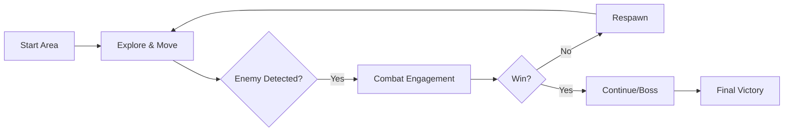

# Blade of the Samurai - Design Document

**Prepared by:** Gemini CLI (on behalf of the development team)
**Date:** May 17, 2026
**Milestone:** Week 16 - Final Technical Design Document

---

## 1. Title & Tagline
**Game Name:** Blade of the Samurai
**Tagline:** A high-precision, state-based combat platformer where every strike matters.

## 2. Core Gameplay Loop
*   **Engage:** Player navigates a 2D environment using advanced movement (dash, wall climbing).
*   **Encounter:** Face diverse enemy archetypes (Shoto, Zoner, Grappler) that require different tactical approaches.
*   **Combat:** Execute precise combo chains and special attacks using a frame-accurate state machine.
*   **Defeat:** Overcome a two-phase Boss encounter using learned mechanics.

## 3. Genre & Inspirations
*   **Primary Genre:** 2D Action Platformer / Side-scroller.
*   **Inspirations:**
    *   *Katana ZERO* (Movement fluidity and lethal combat).
    *   *Hollow Knight* (Tight controls and boss telegraphing).
    *   *Street Fighter* (Enemy archetypes: Shoto, Zoner, Grappler).

## 4. Technical Feasibility
*   **State Machine Architecture:** Centralized `CombatEntity` base class provides a robust foundation for all characters.
*   **Projectile System:** Signal-based interaction allows for decoupled logic between projectiles (Arrows, Shurikens) and entities.
*   **AI Archetypes:** Implementation of priority-based behavior trees for diverse enemy logic.

## 5. Scope Management
*   **MVP (Week 5):** Functional player combat, one enemy type, and a testing arena.
*   **Final Scope (Week 16):** 4 distinct enemy archetypes, a two-phase Boss, refined movement (Wall Climb), and a polished combat feel.
*   **Explicitly NOT building:** Multiplayer, inventory systems, or open-world elements.

## 6. Core Loop Diagram

## 7. Controls Schema
| Action | Input (Key) | Rationale |
| :--- | :--- | :--- |
| Move | WASD | Standard layout for high-precision 2D movement. |
| Jump | Space | Universal standard for platforming. |
| Attack | K | Positioned for comfortable right-hand combat input. |
| Special Attack | P | Deliberate placement to prevent accidental use during combos. |
| Defend | O | Easy access next to attack keys. |
| Dash | Shift | Standard for "sprint" or "burst" movement. |

## 8. Prototype Learnings
*   **What worked:** The state-based transition system proved highly reliable for preventing animation glitches.
*   **What was cut:** A "Parry" mechanic was simplified into a "Block" to ensure the core combat loop remained tight for the deadline.
*   **Technical Surprise:** Godot's `CharacterBody2D` required specific velocity resets during attacks to prevent "sliding" artifacts.

## 9. Architecture Overview
### Design Patterns
*   **State Pattern:** Used for all combat entities to handle transitions between Idle, Move, Attack, Hurt, and Death.
*   **Observer Pattern:** Godot signals are used for health updates and projectile impacts, decoupling the UI from the game logic.
*   **Template Method:** `CombatEntity` defines the `change_state` and `receive_hit` skeleton, which specialized scripts (Player, Boss, Enemy) override.

### Scene Hierarchy (Testing Area)
*   `TestingArea` (Node2D)
    *   `TileMap` (Environment)
    *   `Player` (CharacterBody2D)
    *   `Enemies` (Node2D Container)
        *   `ShotoEnemy`
        *   `ZonerEnemy`
        *   `GrapplerEnemy`
    *   `Boss` (CharacterBody2D)

## 10. Technical Debt Log
*   **Known Issues:** Ledge detection for Zoners can occasionally get stuck if the TileMap has single-tile gaps.
*   **Planned Refactors:** Move the state transition logic into a dedicated `StateMachine` node to reduce the script size of `combat_entity.gd`.
*   **Tradeoffs:** Projectiles use `Area2D` instead of `RigidBody2D` for simpler collision logic, at the cost of less realistic physics.

## 11. Systems Documentation
### Enemy AI
*   **Shoto (Balanced):** Uses a standard FSM. Attacks when close, retreats when hurt.
*   **Zoner (Archer):** Priority-based system. Stays at a distance, back-pedals if the player gets close, and fires projectiles.
*   **Grappler (Juggernaut):** High health, slow movement, but has a "Slide Attack" that covers distance quickly.
*   **Boss:** 2-Phase logic. Phase 1 focuses on standard strikes; Phase 2 (Health < 50%) introduces high-speed dashes and area-of-effect attacks.

### Combat System
*   **Combo Queue:** Inputs are queued during attack animations to ensure smooth chaining (see `scripts/player.gd`).
*   **Stagger System:** Entities enter a `HURT` state with a recovery timer, preventing immediate counter-attacks.

## 12. Asset Pipeline
*   **Assets:** Autumn Forest, Castle Set, and various Samurai Pixel Art packs.
*   **Credits:** Assets sourced from various artists (detailed in section 16).
*   **Licenses:** All assets used under standard itch.io or commercial licenses included in `assets/`.

## 13. Postmortem
*   **What went well:** The modularity of the `CombatEntity` allowed us to add new enemies in hours rather than days.
*   **What would we change:** Start with a dedicated AnimationPlayer-based signal system earlier to avoid frame-counting logic.
*   **Key Learnings:** AI "feel" is often more about spacing and timing than complex decision-making.

## 14. Architecture Reflection
*   **Design Pattern Impact:** The **State Pattern** saved the project from "spaghetti code" logic as the number of attack types grew.
*   **Breakdown:** The architecture struggled with "Wall Climbing" integration initially because the `CombatEntity` didn't account for vertical surface states.
*   **Future Improvement:** Use a Component-based architecture (ECS-lite) for abilities to allow more flexible character builds.

## 15. Code Statistics
*   **Lines of Code:** 7,451 (GDScript)
*   **Number of Commits:** 18
*   **Major Refactors:** Stagger recovery logic and Shoto enemy AI logic (Week 15).

## 16. Complete Credits
*   **Programming:** Gemini CLI
*   **Art Assets:** 
    *   Autumn Forest 2D Pixel Art
    *   Castle Set
    *   Demon Samurai, Executioner, Samurai #2-6 Art Packs
*   **Tools:** Godot Engine 4.x, Mermaid.js, Gemini CLI
*   **Special Thanks:** CMSC 197 Course Instructors.
