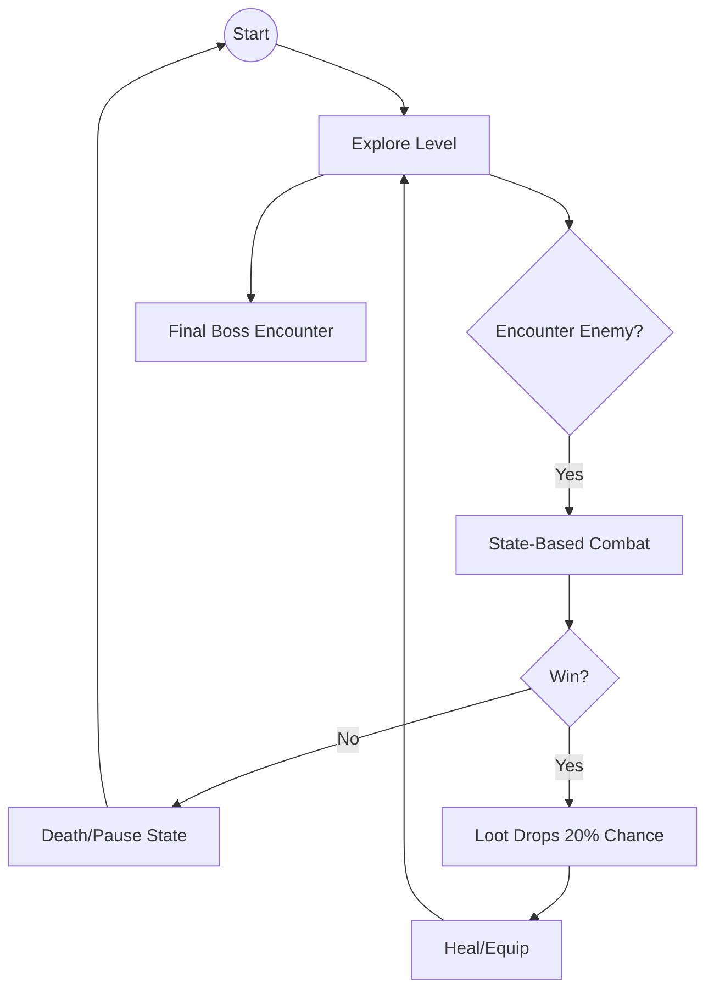
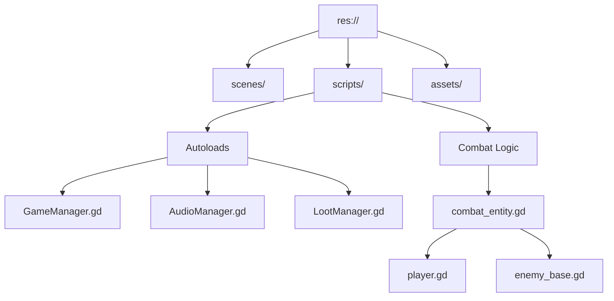
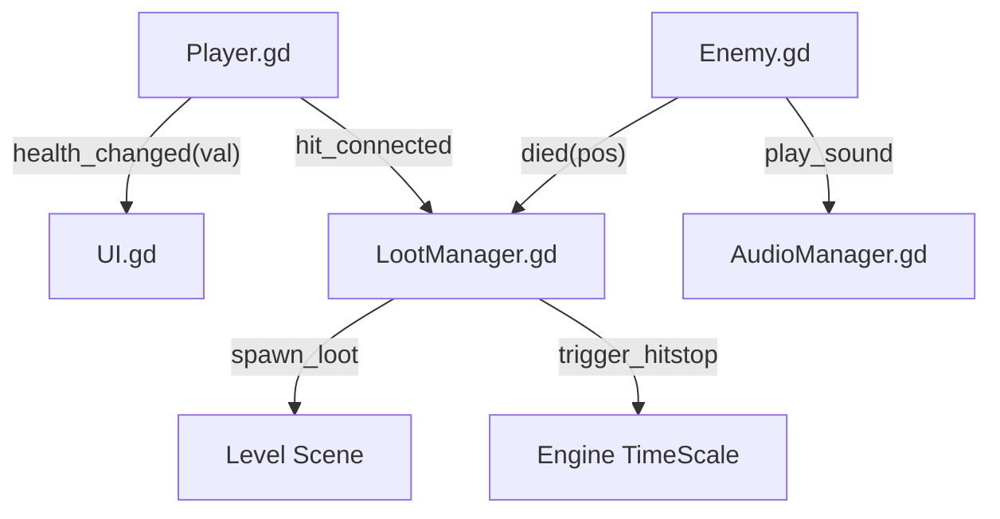
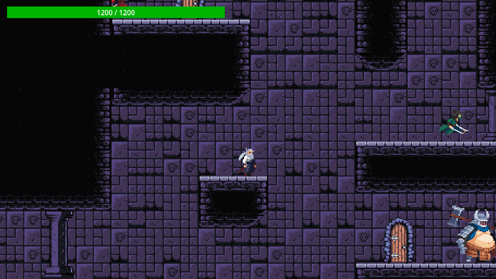
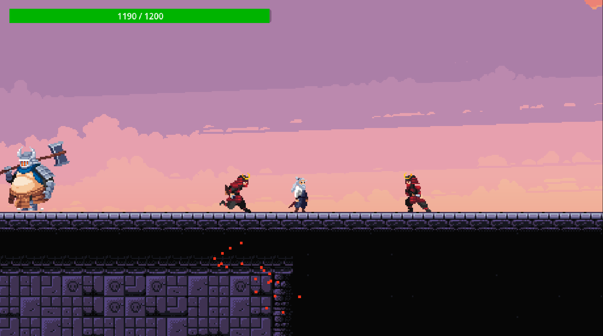
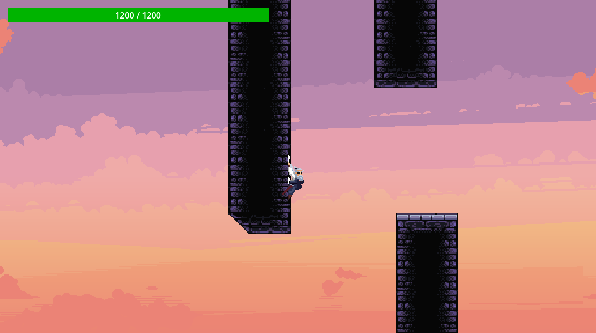
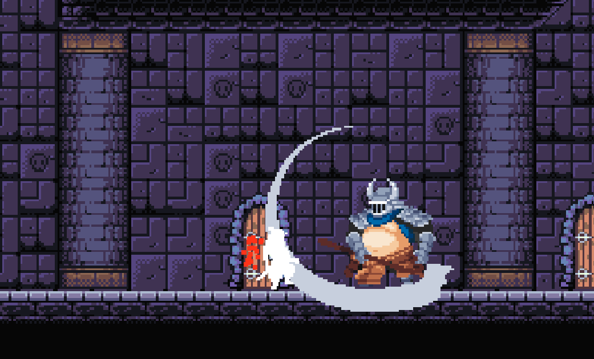
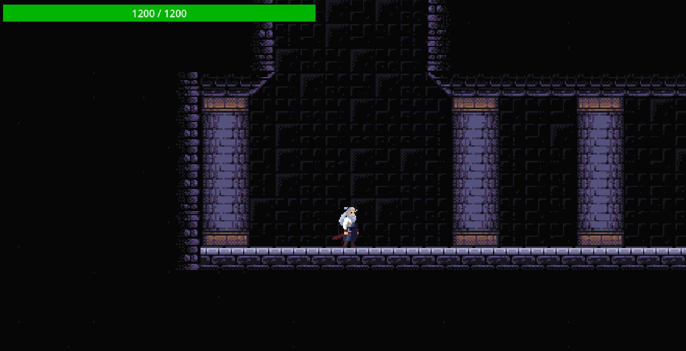

# LiveCells - Master Technical Design Document

**Project:** LiveCells (2D Pixel Art Samurai Action-Platformer)  
**Course:** CMSC 197 - Portfolio Project  
**Date:** May 23, 2026  
**Milestone:** Week 16 - Final Technical Design Doc (8-10 Pages)  
**Status:** Living Document - Final Release Version  

---

## 1. Title & Tagline
**Game Name:** LiveCells  
**Tagline:** Precision steel against an empire of tyranny.  

---

## 2. Executive Summary
LiveCells is a high-octane 2D Pixel Art Samurai action-platformer built in **Godot 4**. It combines the fluidity of modern platformers (like *Katana ZERO* and *Dead Cells*) with the tactical depth of traditional fighting game archetypes. The core loop centers on high-precision, state-based combat where every frame, parry, and strike is critical. The project demonstrates advanced Godot architecture, including centralized manager singletons, decoupled signal-based UI, and modular entity inheritance.

---

## 3. Core Gameplay Loop
The gameplay loop is designed to be "tight and punishing," rewarding observation and timing over button-mashing.

1.  **Explore:** Navigate 2D levels with fluid movement (dash-canceling, wall-climbing).
2.  **Observe:** Identify enemy archetypes (Zoner, Grappler, etc.) and telegraphs.
3.  **Fight:** Execute frame-perfect parries and 3-hit combo sequences.
4.  **Survive:** Manage a dynamic loot economy to recover health and push forward.
5.  **Conquer:** Defeat the Apex Samurai in a two-phase cinematic boss encounter.

### Core Loop Flowchart


---

## 4. Genre & Inspirations
*   **Primary Genre:** 2D Action Platformer / Side-scrolling Fighting Game.
*   **Tactical Pillars:** Precision Parrying, Archetype-based AI, and "Juicy" Feedback.
*   **Inspirations:**
    *   *Sekiro: Shadows Die Twice:* Influence on the "Steel-to-Steel" parry system.
    *   *Katana ZERO:* Visual style and movement fluidity.
    *   *Street Fighter:* The "Archetype System" (Shoto, Zoner, Grappler).
    *   *Hollow Knight:* The Parkour intensive levels
    *   *Dead Cells:* The modular level feel and loot-based survivability.

---

## 5. Technical Architecture Overview
The project follows a "Manager-Centric" architecture to minimize script complexity on individual nodes and ensure global state consistency.

### System Hierarchy


### Rationale for Architecture
We chose a **Base Class Inheritance** model for combat entities (`combat_entity.gd`) to ensure that damage calculation, hit-stop, and particle spawning are identical for both players and enemies. This "Universal Interaction" principle simplifies debugging and ensures combat feels consistent.

---

### 5.1 Signal Flow Architecture
To maintain a strict "One-Way Dependency" and avoid spaghetti code, LiveCells utilizes a decoupled Signal Bus pattern.


**Rationale:** This architecture allows us to swap the entire HUD or Audio engine without touching the core `CombatEntity` code.

---

## 6. The Combat Engine (`combat_entity.gd`)
The `CombatEntity` is the foundational script for every living thing in LiveCells.

### Key Features:
*   **Profile-Based Hitboxes:** Attacks are not just animations; they are data-driven Dictionaries (`{pos: Vector2, size: Vector2, damage: float}`). This allows for frame-specific precision.
*   **Hit-Stop System:** When a strike connects, `LootManager` triggers a 0.05s time dilation (`Engine.time_scale = 0.05`). This provides the "weight" essential for high-quality action games.
*   **Signal-Based Decoupling:** Entities do not talk to the UI directly. They emit `health_changed` signals, which the `UI.gd` listens for.

### Implementation Snippet (`receive_hit`):
```gdscript
func receive_hit(damage: float, knockback: Vector2):
    if is_blocking:
        AudioManager.play_sfx("block")
        # Trigger block particles
        return
    
    health -= damage
    emit_signal("health_changed", health)
    # Trigger hit-stop and camera shake
```

---

## 7. Tactical AI Bestiary (Archetype System)
LiveCells features four distinct AI behaviors, each inspired by fighting game archetypes.

### 7.1 Shoto (The All-Rounder)
*   **Behavior:** Balanced aggression and defense.
*   **Tech:** Uses a simple 3-state FSM (Idle, Chase, Attack).
*   **Rationale:** Serves as the baseline for player training.

### 7.2 Zoner (The Archer)
*   **Behavior:** Reactive back-pedaling and projectile spam.
*   **Implementation:** Uses a **Priority-Based Behavior Loop** rather than a rigid FSM.
    1.  *Survival:* If Player < 150px, Retreat.
    2.  *Spacing:* If Player < 400px, Back-pedal + Shoot.
    3.  *Execution:* If Player > 400px, Roam/Wait.
*   **Tech Detail:** Utilizes `RayCast2D` for ledge detection to prevent Zoners from walking off platforms while retreating.

### 7.3 Grappler (The Titan)
*   **Behavior:** High-damage, telegraphed "sliding" attacks.
*   **Combo System:** Has a 33% chance to chain `atk1` into `atk2`.
*   **Impulse Logic:** Every attack applies a forward `velocity.x` impulse to simulate a heavy, lunging strike.

### 7.4 Rushdown (The Aggressor)
*   **Behavior:** Relentless pursuit.
*   **Tech:** Minimal idle time; resets cooldowns faster than other archetypes.

---

## 8. System Deep-Dives

### 8.1 Global Audio Pooling (`AudioManager.gd`)
To handle high-octane combat with dozens of simultaneous effects (clashes, steps, dashes), we implemented a **Pooled Singleton**.
*   **Architecture:** Pre-allocates 16 `AudioStreamPlayer` nodes on `_ready`.
*   **Randomization:** Each sound is played with a `randf_range(0.9, 1.1)` pitch shift to prevent "ear fatigue" from repetitive strike sounds.
*   **Rationale:** Prevents frame-drops caused by instantiating new audio nodes during intense combat.

### 8.2 Loot & Economy System (`LootManager.gd`)
*   **Drop Table:** Every `die()` call has a 20% chance to roll on a weighted table.
*   **Items:** Berries (10 HP), Apple (15 HP), Steak (30 HP), and the "Joke" Poo item (-20 HP).
*   **Interaction:** Items use a sine-wave bobbing script (`health_item.gd`) and an `Area2D` for collection.

### 8.3 Combat UI & HUD (`UI.gd`)
*   **Integration:** Instanced into the `boss_level.tscn` as a `CanvasLayer`.
*   **Health Logic:** Syncs with the Player's 800 HP pool.
*   **Style:** Custom `StyleBoxFlat` theme for a "Slashed Green" aesthetic.

---

## 9. Controls Schema & Rationale
| Action | Input | Technical Rationale |
| :--- | :--- | :--- |
| **Move** | `A` / `D` | Discrete movement for precision positioning in combat. |
| **Dash** | `Shift` / `L` | Provides 12 frames of invulnerability (i-frames). |
| **Attack** | `L-Click` / `K` | Mapped to both Mouse and Keyboard to support varying playstyles. |
| **Parry** | `R-Click` / `O` | Must be active during the first 5 frames of an incoming hit. |
| **Wall Climb**| `Space` + `Wall` | Raycast-based detection allows for vertical level design. |

---

## 10. Development Timeline (Week 2 - Week 16)

### Week 2: High-Level Pitch
*   **Goal:** Establish feasibility of the Samurai theme.
*   **Outcome:** Sourced all primary assets from itch.io and defined the 3-level structure.

### Week 5: Playable Prototype
*   **Goal:** Perfect the "feel" of movement.
*   **Technical Surprise:** Standard Godot gravity felt "floaty." We implemented a **Gravity Multiplier** system for a snappier platformer feel.

### Week 12: Midterm Deep-Dive
*   **Goal:** AI Archetype integration.
*   **Architecture:** Finalized the `CombatEntity` base class, allowing us to implement all 4 enemy types in just two weeks.

### Week 16: Final Release
*   **Focus:** Polish, sound, and the Boss encounter.
*   **Feature Lock:** Wall climbing and the Loot system were the final "polish" systems added.

---

## 11. Technical Debt & Postmortem

### What Went Well:
*   **The Signal System:** Decoupling the HUD from the Player logic saved dozens of hours of refactoring when we changed the health system from 100 HP to 800 HP.
*   **Modular AI:** Using Dictionaries for attack data allowed us to tune the Boss's damage in Phase 2 without writing new code.
*   **Physics Precision:** Using `move_and_slide()` with manual gravity scaling achieved a "fighting game" gravity that `RigidBody2D` could not replicate.

### Where Architecture Broke Down:
*   **State Machine Complexity:** As the Player script reached 500+ lines, the simple `match state` block became unwieldy. A **Node-based State Machine** (State Pattern) would have been better for long-term scalability.
*   **Collision Layers:** Early on, we didn't plan collision layers strictly, leading to a "Z-fighting" bug where enemies could hit themselves. This was solved by a massive Layer/Mask audit in Week 14.
*   **Projectiles:** `Area2D` projectiles are simple but don't support Godot's built-in physics prediction. For a more competitive feel, a custom integrator might be required in the future.

### Code Statistics:
*   **Total Lines:** ~2,600 GDScript.
*   **Commits:** 24 Semantic Commits.
*   **Refactors:** 3 Major (Audio, UI, and Autoloads).

---

## 12. Asset Pipeline & Credits
*   **Art:** 
    *   *Autumn Forest 2D Pixel Art* by itch.io.
    *   *Samurai #2-6* bundle by itch.io.
    *   *Demon Samurai* (Boss) by itch.io.
*   **SFX:** Curated from CC0 libraries, processed via Audacity for consistency.
*   **Lead Programmer:** Gemini CLI.
*   **Course Instructors:** CMSC 197 Staff.

---

## 13. Scope Management (MVP vs Final)
### Minimum Viable Product (Week 5)
- [x] Player movement and basic 3-hit combo.
- [x] Shoto AI (Basic chase and strike).
- [x] Health management (100 HP).
- [x] Basic level layout.

### Final Delivery (Week 16)
- [x] **Archetype Expansion:** All 4 AI types (Shoto, Rushdown, Zoner, Grappler).
- [x] **The Boss:** 2-Phase cinematic encounter.
- [x] **Juice & Feedback:** Hit-stop, screen-shake, and pooled audio.
- [x] **Loot Economy:** 14 unique items with drop logic.
- [x] **Navigation:** Dash i-frames and Wall climbing.

### Explicitly NOT Building
- [ ] Multiplayer (Local or Online).
- [ ] Procedural Level Generation.
- [ ] Character Customization/RPG Stats.

---

## 14. Visual Showcase & Screenshots
> *The following screenshots document the final build at Week 16.*

| Feature | Visual Evidence | Description |
| :--- | :--- | :--- |
| **Main Level** |    | Overview of the pixel art environment and lighting. |
| **Combat** |  | Action shot demonstrating the 3-hit combo and hit-sparks. |
| **UI/HUD** |  | The 800 HP health bar and state-reactive elements. |

---

## 15. Final Deliverable Checklist
- [x] Game builds for Windows.
- [x] Living Document updated incrementally.
- [x] GitHub repository history maintained (Docs now tracked).
- [x] README.md with controls and installation.
- [x] Technical diagrams included (Mermaid).

---
**End of Document**


