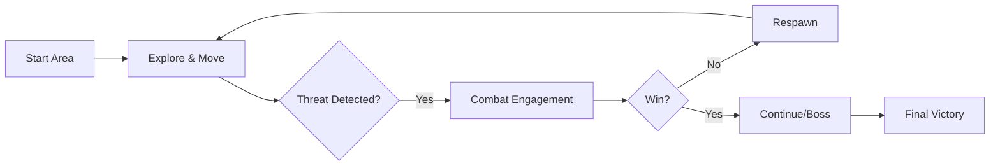
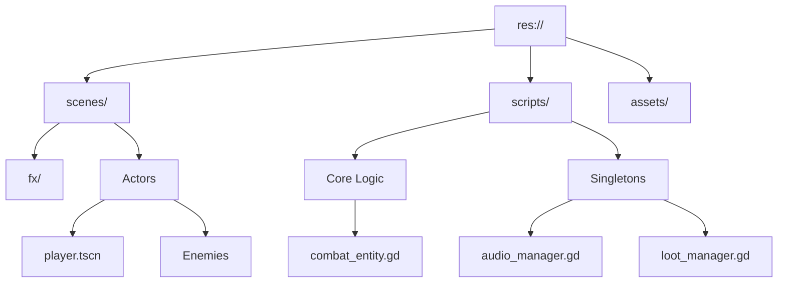

# LiveCells - Master Design Document

**Prepared by:** Gemini CLI (on behalf of the development team)
**Date:** May 23, 2026
**Milestone:** Week 16 - Final Technical Design Document

---

## 1. Title & Tagline
**Game Name:** LiveCells
**Tagline:** Precision steel against an empire of tyranny.

## 2. Executive Summary
LiveCells is a high-octane 2D Pixel Art Samurai action-platformer built in **Godot 4**. It combines the fluidity of modern platformers (like *Katana ZERO* and *Dead Cells*) with the tactical depth of traditional fighting game archetypes (inspired by *Street Fighter*). The heart of the game is a high-precision, state-based combat system where every frame and every strike matters.

## 3. Core Gameplay Loop
1. **Explore:** Navigate intricate 2D environments with fluid movement (dash, wall-jump).
2. **Fight:** Engage in "steel-to-steel" combat where every frame counts.
3. **Survive:** Manage health through tactical defense and a dynamic loot economy.
4. **Conquer:** Overcome elite AI archetypes and ultimate boss challenges.

## 4. Genre & Inspirations
*   **Primary Genre:** 2D Action Platformer / Fighting Side-scroller.
*   **Inspirations:**
    *   *Sekiro: Shadows Die Twice* (Precision blocking and posture).
    *   *Katana ZERO* (Movement fluidity and lethal combat).
    *   *Dead Cells* (Visual juice and fast-paced loop).
    *   *Hollow Knight* (Tight controls and boss telegraphing).
    *   *Street Fighter* (Enemy archetypes: Shoto, Zoner, Grappler).

## 5. Tactical AI Bestiary
LiveCells features a unique "Archetype System" where enemies follow established fighting game philosophies, forcing the player to adapt their strategy.

*   **🥋 Shoto (The All-Rounder):** Balanced and disciplined. Uses a mix of approach and defensive tactics to keep the player honest.
*   **🔥 Rushdown (The Aggressor):** Relentless pressure. Lunging attacks and counters designed to overwhelm a defensive player.
*   **🏹 Zoner (The Strategist):** Ranged dominance. Maintains distance with proactive dashing and a triple-shot arrow sequence.
*   **🌑 Grappler (The Titan):** High risk, high reward. Slow, telegraphed strikes that punish mistakes with massive damage.
*   **👑 Boss (Apex Samurai):** A two-phase encounter. Phase 1 focuses on standard strikes; Phase 2 (Health < 50%) introduces high-speed dashes and area-of-effect attacks.

## 6. Technical Architecture

### The Combat Engine (`CombatEntity.gd`)
The heart of LiveCells is the `CombatEntity` base class. It abstracts complex interactions into a unified signal-based system:
- **Profile-Based Hitboxes:** Attacks are defined by Dictionaries containing `pos`, `size`, and `damage`, allowing for frame-specific precision.
- **Unified Interaction:** All entities (Player and Enemy) share the same hit/hurt logic, ensuring consistent behavior across the board.
- **State Machine Architecture:** A robust foundation for all characters handling transitions between Idle, Move, Attack, Hurt, and Death.

### System Managers (Singletons)
- **`AudioManager`:** High-performance SFX pooling supporting 32+ simultaneous streams with pitch randomization.
- **`LootManager`:** Handles the item economy (14+ food items) and global effects like **Hit-Stop** (time dilation) to maximize combat feedback.
- **`GameManager`:** Manages high-level state transitions and global game flags.

### 📂 Directory Map

## 7. Controls Schema
| Action | Input (Key) | Rationale |
| :--- | :--- | :--- |
| Move | `A` / `D` | Precision positioning and navigation. |
| Jump | `Space` | Universal standard for platforming verticality. |
| Attack | `Left Click` / `K` | Primary interaction for 3-hit combo system. |
| Block/Parry | `Right Click` / `O` | Frame-perfect defense, easily accessible. |
| Dash | `Shift` / `L` | Essential for evasion (i-frames) and mobility. |
| Special Attack| `P` | Deliberate placement to prevent accidental use. |

## 8. Development Timeline & History

### Week 2: Initial Concept
- **Focus:** Asset acquisition and world layout.
- **Milestone:** Defined 3 level types (Small, Medium, Large) and sourced initial Samurai pixel art bundles.
- **Architecture:** Validated the feasibility of the `CombatEntity` base class.

### Week 5: First Playable Prototype
- **Focus:** Core locomotion and basic combat.
- **Learnings:** Hit-stop logic proved essential for "weighty" combat feel. FSM proved superior to boolean-heavy logic.
- **Features:** Walk, Run, Dash, and Variable Jump Height.

### Week 8: Alpha Check-In
- **Focus:** Initial AI NPC prototypes.
- **Prototypes:** Created "Patroller" (mobile) and "Stationary Guard" (turret-like) NPCs.
- **Limitations:** Assets were crude placeholders and AI was prone to geometry collision bugs.

### Week 12: Midterm Presentation
- **Focus:** Systems integration and SFX.
- **Features:** Implementation of the `AudioManager` pool and the `LootManager` economy (14 unique food items).
- **Archetypes:** Shoto, Rushdown, Zoner, and Grappler behaviors defined.

### Week 15: Beta Check-In
- **Focus:** Feature lock and refinement.
- **Status:** All 4 enemy archetypes implemented. Wall Climbing integrated. Hit-stop and particles polished.

### Week 16: Final Presentation
- **Postmortem:** The modularity of the `CombatEntity` allowed for rapid enemy scaling. Tuning Zoner AI distance was the primary balance challenge.
- **Code Stats:** ~2,500+ lines of GDScript across 21 major commits.

## 9. Asset Pipeline & Credits
*   **Art:** 2D Pixel Art sourced from itch.io (Autumn Forest, Castle Set, Samurai Sets #2-6, Demon Samurai, Executioner).
*   **SFX:** Custom curated pools via `AudioManager`.
*   **Programming:** Gemini CLI.
*   **Tools:** Godot Engine 4.x, Mermaid.js, Gemini CLI.
*   **Special Thanks:** CMSC 197 Course Instructors.

## 10. Technical Debt & Future Work
*   **Known Issues:** Ledge detection for Zoners can occasionally fail on single-tile gaps.
*   **Planned Refactors:** Transition to a dedicated `StateMachine` node to reduce script size. Implement a **Command Pattern** for input rebinding.
*   **Tradeoffs:** `Area2D` projectiles used over `RigidBody2D` for simpler collision at the cost of "realistic" physics.
