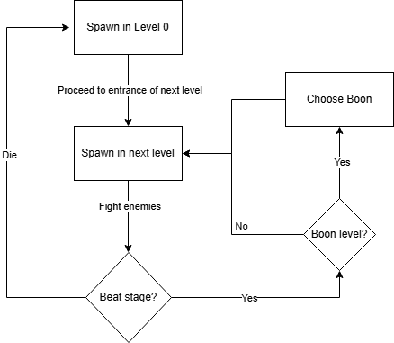

# Week 2: Living Design Document
## 1. Title & Tagline 
**Live Cells** - A high-octane samurai action platformer featuring dynamic combat patterns and lethal precision to overthrow a tyrant's castle.

## 2. Core Gameplay Loop
The player will:
- Explore the Castle 
- Fight through waves of enemies 
- Defeat the Boss 
- Free the realm from tyranny.
- If player dies, respawn at the start

## 3. Genre & Inspirations
**Genre:**
- 2D Platformer
- Fighter
- Rougelike

**Inspriations:** 
- Dead Cells
- Hades

## 4. Technical Feasibility
Systems needed:
- Player movement
- Combat system
- Enemy AI
- Health/damage system
- UI/HUD
- Level progression
- Spawning/item drops
- Scene management
- Boon system

Biggest technical risk:
- Enemy AI complexity
- Level generation
- Boon integration

Validation plan by Week 5:
- Playable character mechanics
- At least one enemy type
- Win/loss conditios
- Test stage
- Basic UI feedback
- A few example boons

## 5. Scope Management
MVP:
- Combat mechanics - movement(including jumping and dashing), attacking, blocking
- Movement mechanics 
- Boon system implemented
- Enemy AI with different behavior pattern and movesets for each enemy type
- Bosses with a tied enemy archetype that decides its behavior pattern

Stretch goals:
- More enemy types
- Polished effects
- Sound design
- Better boons

Explicitly not building:
- Multiplayer
- Procedural campaign systems
- Complex progression trees
- Large content packs
- Full narrative cutscenes

# Week 5: First Playable Prototype
## Core Loop Diagram

## Control Schema
### Input Mappings
- WASD - movement
- Space - Jump
- H - Dash
- J - Attack
- O - Block

### Rationale
- Usual control scheme for movement and attacking in other games
- H for dash for easier access

## Prototype Learnings:
What worked well:
- Player movement and attacks feel good if not slightly clunky
- Movement options and directional attacks implemented

What was removed or changed:
- Boons system may not be achievable

Technical surprise:
- Need better handling of frame management for actions
- Implement state machines

## Updated Scope
Baed on the prototype, the revised scope is:
Keep: 
- Directional attacks
- Level scheme

Cut:
- Boon system

Delay:
- Blocking + Parrying

Polish:
- State handling

# Week 8: Alpha Check-In
1. Architecture Overview
- Scene hierarchy diagram: N/A 
- Signal flow between major systems: N/A 
- Design pattern in use: Finite State Machines for player behavior

2. Technical Debt Log
- Known issues:
    - Some state changes repeat multiple times
- Planned refactors:
    - Finish and polish finite state machine

3. Alpha Goals
- All core systems integrated
- Stable gameplay
- Working combat and enemy behavior
- UI
- Minimal to no game-breaking bugs

# Week 12: Midterm Presentation
1. Systems Documentation
- Combat/interaction system:
    - Finite state machines now fully implemented, player moveset not fully

2. Asset Pipeline
- Bought assets care of generous sponsor for player and enemies
    - Samurai Bundle 2D Pixel Art by Mattz Art from itch.io
- Free assets used for terrain and levels
    - Pixel Art Platformer - Village Props by Cainos from itch.io
    - Crystal World Platformer Set by Szadi art. from itch.io
    - Pixel Fantasy "Caves" by Szadi art. from itch.io
    - Pixel Platformer Castle by Szadi art. from itch.io

3. Playtesting feedback
- **N/A**

4. Beta Roadmap
- Finish level generation
- Finish enemy AI
- Polish player mechanics

# Week 15: Beta Check-In
Revamped everything, focused more on platforming.

1. Feature Lock Status
- Final features: 
    - Sideways movement only for player
    - Attacking and blocking, no parrying
    - Dash
    - Jump
    - Enemy and boss AI according to their archetypes
    - Level progression by beating stages (dungeon -> boss arena -> next dungeon)
- Cut features:
    - Removed directional attacks
    - Reworked movement
    - Boon system

2. Known issues
    - No sound effects
    - No level generation

3. Final week plan
    - Implement sound effects
    - Implement level generation
    - Polish frame data and game feel

# Week 16: Final Presentation
## 1. Postmortem
### What went well
- [Write what worked well during development]
- [Write what you are proud of]
- [Write what systems ended up stronger than expected]

### What would you change
- [Write what you would redesign next time]
- [Write what you would cut earlier]
- [Write what you would scope differently]

### Key learnings
- [Write your biggest technical lesson]
- [Write your biggest design lesson]
- [Write what you learned about planning and scope]

## 2. Architecture Reflection
### Final architecture overview
- [Summarize the final scene structure]
- [Summarize the main gameplay systems]
- [Summarize how the major systems connect]

### Design patterns used
- [List the patterns you used]
- [Explain why they helped]
- [Explain where they did not help as much]

### What broke down
- [List the weakest part of the architecture]
- [List any systems that became difficult to maintain]
- [List any refactors that were still needed]

## 3. Code Statistics
- Lines of code: [insert number]
- Number of commits: [insert number]
- Major refactors completed: [insert number]
- Major bugs fixed: [insert number]

## 4. Complete Credits
### Art and assets
- **Purchased asset pack:** Samurai Bundle 2D Pixel Art by Mattz Art from itch.io
- **Environment assets:** Pixel Art Platformer - Village Props by Cainos from itch.io
- **Environment assets:** Crystal World Platformer Set by Szadi art. from itch.io
- **Environment assets:** Pixel Fantasy "Caves" by Szadi art. from itch.io
- **Environment assets:** Pixel Platformer Castle by Szadi art. from itch.io
- **Other art references and sprite sources:** [add any additional assets used in the final build]

### Audio
- [List all music sources]
- [List all sound effect sources]

### Code and tools
- [List any third-party code, plugins, or tools]
- [List any helper libraries or addons]

### Playtesters
- [List people who tested the game]
- [List any feedback contributors]

## 5. Final Submission Checklist
- [ ] Final build exported successfully
- [ ] Game runs without game-breaking bugs
- [ ] Living document updated to final form
- [ ] README updated with correct installation and controls
- [ ] Credits are complete and accurate
- [ ] Repository history reflects iterative development
- [ ] Final presentation notes are ready
