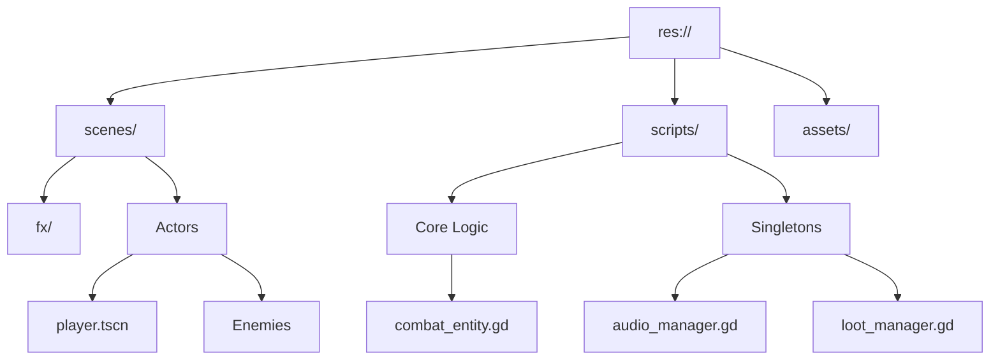

# LiveCells README Overhaul Implementation Plan

> **For agentic workers:** REQUIRED SUB-SKILL: Use superpowers:subagent-driven-development (recommended) or superpowers:executing-plans to implement this plan task-by-task. Steps use checkbox (`- [ ]`) syntax for tracking.

**Goal:** Transform the project README into a high-quality technical and player-facing showcase.

**Architecture:** A segmented, modern Markdown document using GitHub-flavored features (tables, blockquotes, Mermaid diagrams, and `<details>` tags) to cater to players, contributors, and technical reviewers.

**Tech Stack:** Markdown, Mermaid.js (for diagrams).

---

### Task 1: Foundation & Header
**Files:**
- Modify: `README.md`

- [ ] **Step 1: Replace header and intro**
Create the "Hero" section with a modern tagline and badges.

```markdown
# 🗡️ LiveCells

> **Precision steel against an empire of tyranny.**

LiveCells is a high-octane 2D Pixel Art Samurai action-platformer built in **Godot 4**. It combines the fluidity of modern platformers with the tactical depth of traditional fighting game archetypes.


---
```

- [ ] **Step 2: Add Gameplay Loop & Styled Controls**
Implement the core loop and the "fancy" controls table inside a blockquote.

```markdown
## 🎮 The Experience

### The Core Loop
1. **Explore:** Navigate intricate 2D environments with fluid movement (dash, wall-jump).
2. **Fight:** Engage in "steel-to-steel" combat where every frame counts.
3. **Survive:** Manage health through tactical defense and a dynamic loot economy.
4. **Conquer:** Overcome elite AI archetypes and ultimate boss challenges.

### ⌨️ Controls Manual
> | Action | Input | Rationale |
> | :--- | :--- | :--- |
> | **Move** | `A` / `D` | Precision positioning. |
> | **Jump** | `Space` | Fluid verticality. |
> | **Attack** | `Left Click` / `K` | 3-Hit combo system. |
> | **Parry** | `Right Click` / `O` | Frame-perfect defense. |
> | **Dash** | `Shift` / `L` | Evasion with i-frames. |
```

- [ ] **Step 3: Commit Task 1**
`git add README.md && git commit -m "docs: implement hero header and gameplay sections"`

---

### Task 2: AI Bestiary (Technical Showcase)
**Files:**
- Modify: `README.md`

- [ ] **Step 1: Add AI Archetypes Section**
Document the 4 fighting-game inspired AI behaviors.

```markdown
## 🧠 Tactical AI Bestiary
LiveCells features a unique "Archetype System" where enemies follow established fighting game philosophies, forcing the player to adapt their strategy.

*   **🥋 Shoto (The All-Rounder):** Balanced and disciplined. Uses a mix of approach and defensive tactics to keep the player honest.
*   **🔥 Rushdown (The Aggressor):** Relentless pressure. Lunging attacks and counters designed to overwhelm a defensive player.
*   **🏹 Zoner (The Strategist):** Ranged dominance. Maintains distance with proactive dashing and a triple-shot arrow sequence.
*   **🌑 Grappler (The Titan):** High risk, high reward. Slow, telegraphed strikes that punish mistakes with massive damage.
```

- [ ] **Step 2: Commit Task 2**
`git add README.md && git commit -m "docs: add AI archetypes showcase"`

---

### Task 3: Technical Deep Dive (Contributor Focus)
**Files:**
- Modify: `README.md`

- [ ] **Step 1: Document Architecture & Systems**
Explain the `CombatEntity` base class and singleton management.

```markdown
## 🏗️ Technical Architecture

### The Combat Engine (`CombatEntity.gd`)
The heart of LiveCells is the `CombatEntity` base class. It abstracts complex interactions into a unified signal-based system:
- **Profile-Based Hitboxes:** Attacks are defined by Dictionaries containing `pos`, `size`, and `damage`, allowing for frame-specific precision.
- **Unified Interaction:** All entities (Player and Enemy) share the same hit/hurt logic, ensuring consistent behavior across the board.

### System Managers (Singletons)
- **`AudioManager`:** High-performance SFX pooling supporting 32+ simultaneous streams with pitch randomization.
- **`LootManager`:** Handles the item economy and global effects like **Hit-Stop** (time dilation) to maximize combat feedback.
- **`GameManager`:** Manages high-level state transitions and global game flags.
```

- [ ] **Step 2: Update Project Structure Diagram**
Refine the Mermaid diagram for better clarity.

```markdown
### 📂 Directory Map

```

- [ ] **Step 3: Commit Task 3**
`git add README.md && git commit -m "docs: implement technical deep dive section"`

---

### Task 4: Logistics & History
**Files:**
- Modify: `README.md`

- [ ] **Step 1: Wrap History in Details**
Move existing milestone documentation into a `<details>` tag.

```markdown
## 📅 Development History

<details>
<summary>Click to view development milestones (Week 1-16)</summary>

[... existing milestone content ...]

</details>
```

- [ ] **Step 2: Add Credits & Setup**
Include setup instructions and asset attributions.

```markdown
## 🛠️ Setup & Contribution
1. Clone the repository.
2. Open `project.godot` in **Godot 4.2+**.
3. Ensure the `godot-mcp-server` addon is enabled if using AI-assisted development.

## 🎨 Asset Credits
Special thanks to the following creators:
- **Art:** itch.io samurai bundles (raou).
- **Music/SFX:** Custom curated pools.
```

- [ ] **Step 3: Final Commit & Cleanup**
`git add README.md && git commit -m "docs: finalize README overhaul and archive history"`
